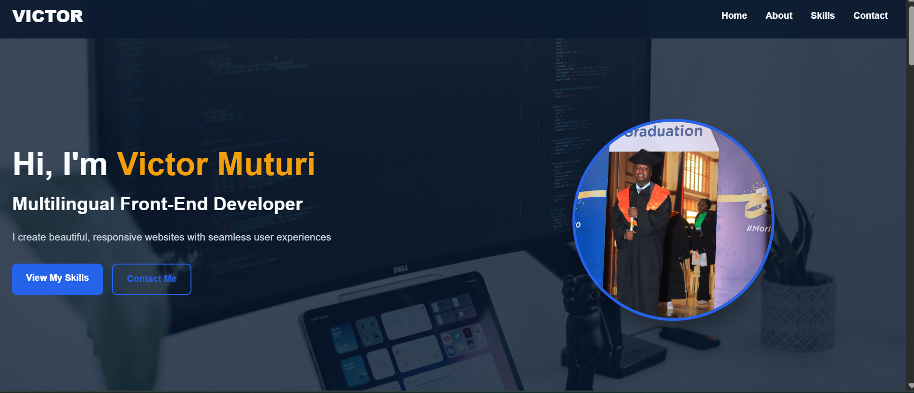

# Victor Muturi - Portfolio Website

 

A modern, responsive portfolio website showcasing my front-end development skills and multilingual capabilities.

## 🔥 Features


- **Responsive Design** - Works on all devices
- **Project Showcase** - With live demo and code links


## 🛠 Technologies Used


## 🚀 Quick Start

1. **Clone the repository**
   ```bash
   git clone https://github.com/GanadorVictor/portfolio.git